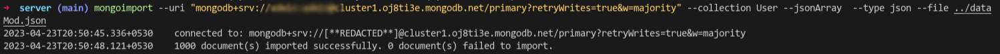

# apiFilter

ApiFilter is an online interface that displays the output of predefined complex queries on a beautiful frontend. An assignment submission for Mobilicis Pvt Limited

## How to access:

- [Vercel](https://mobilicis.vercel.app/) (Frontend)
- [Railway](https://apifilter-api.up.railway.app/) (Backend)

## Note

- All valid routes are available in `server/src/routes/router.tsx`
- All queries are written to be singular DB operations, so no multiple req/res happens between backend and DB server.
- To better reflect the true nature of the data, the initially provided JSON is modified using the `transformer.py` script to typecast floats and ints.
- A simple utility called `mongoimport` is used to then upload the recast JSON to the MongoDB instance.

## Queries Implemented:

- Users who have income lower than $5 USD and have a car of brand “BMW” or “Mercedes-Benz”.
- Male Users who have phone price greater than 10,000.
- Users whose last name starts with “M” and has a quote character length greater than 15 and email includes his/her last name.
- Users which have a car of brand “BMW”, “Mercedes” or “Audi” and whose email does not include any digit.
- Show the data of top 10 cities which have the highest number of users and their average income.

## Stack Used:

### Frontend:

- NextJS(React)
- TailwindCSS + DaisyUI Plugin

### Backend:

- ExpressJS
- Prisma + MongoDB connector
- Helmet + Cors (Security)
- Morgan (Logging)
- EsBuild (Minify and bundle to js)

Everything is handpicked to be type-safe and easily scalable, especially Prisma which works flawlessly with Typescript. Would've used tRPC but it's beyond the scope and scale of this project.

## How to setup?

- Clone repo locally
- `cd server && npm run dev` starts express server on port 5000(refer env vars section)
- `cd client && npm run dev` starts nextjs server on port 3000(refer env vars section)

## Environment variables:

### Client(.env.local):

- `BACKEND_URL`: Specifies which URL to reverse proxy to. Defaults to localhost:5000.
- `REVAL_SECRET`: Specifies secret to be used with webhook that regenerates incremental static generation on demand.

### Server(.env):

- `PORT`: The port to bind the express server instance to.
- `DATABASE_URL`: The connection URL for MongoDB cluster.

## Rendering Paradigms employed:

- For simple use cases, I usually prefer Client side data fetching as initial page load times are superb, thanks to NextJS caching pre-rendered static husks on CDNs. This is CSR (Client side rendering).
- But for our particular use case, I realized the data doesn't change at all for now, and even if it does in the future, I don't expect it to be highly dynamic data. Enter ISR (Incremental static Regeneration).
- But regular ISR is also a tad bit too much, as everytime it rebuilds periodically, it is still the same. We just waste build hours and API calls.
- So I have implemeted ISR on-demand, where the CDN cached statically hudrated page won't re-render until backend gets a successful POST request and calls the frontend server's webhook.(The webhook exists, the POST endpoint on API isn't required as of now).